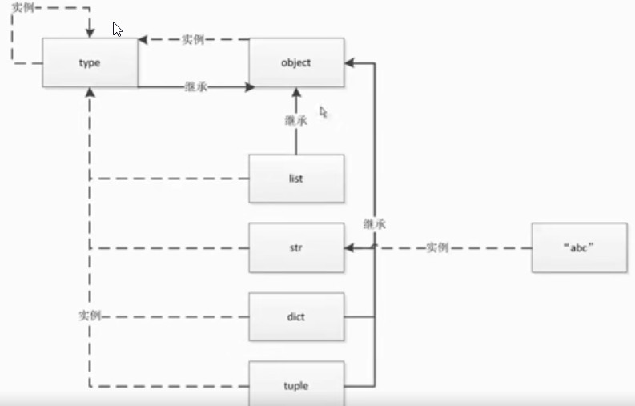

# python高级编程和异步io并发编程<br>
# 一、python中一切皆对象
动态语言和静态语言的区别:
+ python面向对象更彻底

## 1.函数和类也是对象,属于python的一等公民:

+ 赋值给变量
+ 可以添加到集合对象中
+ 可以作为参数传递给函数
+ 可以当作函数的返回值

all_is_object.py:

    def ask(name="bobby"):
        print(name)

    class person:
        def __init__(self):
            print("bobby1")

    def print_type(item):
        print(type(item))

    def decorator_func():
        print("dec start")
        return ask

    myask = decorator_func()
    myask("tom")
    # ob_list = []
    # ob_list.append(ask)
    # ob_list.append(person)
    # for i in ob_list:
    #     print(i())
    # my_func = ask
    # my_func()
    #
    # my_class = person
    # my_class()

## 2.**<font color="red">type、object和class的关系:</font>**


## 3.python中的常见内置类型:

 + 对象的3个特征：
    + 身份： 对象在内存中的地址 id()
    + 类型
    + 值
 + None(全局只有一个)
 + 数值:
     + int
     + float
     + complex(复数)
     + bool  
 + 迭代类型:
     + list
     + bytes、bytearray、memoryview(二进制序列)
     + range
     + tuple
     + str
     + array   
 + 序列类型
 + 映射(dict)
 + 集合:
     + set
     + frozenset(不可修改)
 + 上下文管理类型(with)
 + 其他:
     + 模块类型
     + class和实例
     + 函数类型
     + 方法类型
     + 代码类型
     + object对象
     + type类型
     + ellipsis对象
     + notimplemented类型


# 二、魔法函数

 ## 1.什么是魔法函数
```
    class Company(object):
    def __init__(self, employee_list):
        self.employee = employee_list
    # 魔法函数
    def __getitem__(self, item):
        return self.employee[item]

    def __len__(self):
        return len(self.employee)

    company = Company(["tom", "bob", "jane"])

    # company1= company[:2]
    #
    # print(len(company))
    # 可迭代类型
    # for em in company1:
    #     print(em)
  ```
 ## 2.python的数据模型以及数据模型对python的影响<br>    
    python语法会识别某个对象或自定义类中的魔法函数，调用是隐式的，不需要直接调用getitem方法。魔法函数式独立存在的，类加入这些会增强功能。

 ## 3.魔法函数一览： 
  + 数字运算:

    1.一元运算符 `__neg__(-),__pos__(+),__abs__`
    2.二元运算符 `___lt__(<),__le__(<=),__eq__(==),__ne__(!=),__gt__(>),__ge__(>=)`     
    3.算数运算符:  `__add__+,__sub__-,__mul__*,__truediv__ /,__floordiv__ //,__mod__ %,__divmod__ divmod(),__pow__ **或pow(),__round__ round()`     
    4.反向运算符:   `__radd__,__rsub__,__rmul__,__rtruediv__,__rfloordiv__,__rmod__,__rdivmod__,__rpow__`       
    5.增量复制运算符       `__iadd__ 、 __isub__ 、 __imul__ 、 __itruediv__ 、 __ifloordiv__ 、 __imod__ 、
__ipow__` 
    6.位运算符      `__invert__ ~ 、 __lshift__ << 、 __rshift__ >> 、 __and__ & 、 __or__ | 、 __
xor__ ^`        
    7.反向位运算符       `__rlshift__ 、 __rrshift__ 、 __rand__ 、 __rxor__ 、 __ror__`        
    8.增量赋值位运算符 `__ilshift__ 、 __irshift__ 、 __iand__ 、 __ixor__ 、 __ior__`

  + 非数字运算:
    
    1.字符串表示 `__repr__`,`__str__`    
    2.集合、序列相关 `__len__,__getitem__,__setitem__,__delitem__,__contains__`     
    3.迭代相关 `__iter__,__next__`  
    4.可调用 `__cell__`     
    5.with上下文管理器 `__enter__,__exit__`     
    6.数值转换 `__abs__,__bool__,__int__,__float__,__hash__,__index__`  
    7.元类相关 `__new__,__init__`       
    8.属性相关 `__getattr__,__setattr__,__getattribute__,__setattribute__,__dir__`      
    9.属性描述符 `__get__,__set__,__delete__`       
    10.协程 `__await__,__aiter__,__anext__,__aenter__,__aexit__`


 ## 4.魔法函数的重要性


 ## 三、深入类和对象
 
### 1. 鸭子类型和多态  
   维基百科：
   >动态编程语言是一类在运行时可以改变其结构的语言：例如新的函数、对象、甚至代码可以被引进，已有的函数可以被删除或是其他结构上的变化。动态语言目前非常具有活力如PHP、Ruby、Python 都属于动态语言，而C、C++、Java等语言则不属于动态语言。

这个解释很抽象，其实动态语言是相对静态语言而言的，静态语言的特点是在程序执行前，代码编译时从代码中就可以知道一切，比如变量的类型，方法的返回值类型：

    String s = "hello"
    s = "world"
    s = 1 // 编译时就会报错

在静态语言中，变量有类型信息，它是一块内存区域，静态语言的优点是代码结构非常规范，便于调试，但有时显得啰嗦。而动态语言只有等到程序运行时才知道一切，变量（严格来说叫名字，就像人的名字一样）不需要指定类型，变量本身没有任何类型信息，类型信息在对象身上，对象是什么类型，必须等到程序运行时才知道，动态类型语言的优点在于方便阅读，不需要写很多类型相关的代码；缺点是不方便调试，命名不规范时会造成读不懂，不利于理解等。

    s = "hello"
    s = "world"
    s = 1  # 可以给变量随意赋值，无论是什么类型都可以

**鸭子类型:**<br>
    
---

动态语言中经常提到鸭子类型，所谓鸭子类型就是：如果走起路来像鸭子，叫起来也像鸭子，那么它就是鸭子（If it walks like a duck and quacks like a duck, it must be a duck）。鸭子类型是编程语言中动态类型语言中的一种设计风格，一个对象的特征不是由父类决定，而是通过对象的方法决定的。

如果你学的是Java或者C++等静态语言，可能对鸭子类型的理解没那么深刻，因为静态语言中对象的特性取决于其父类。而动态语言则不一样，比如迭代器，任何实现了 __iter__ 和 __next__方法的对象都可称之为迭代器，但对象本身是什么类型不受限制，可以自定义为任何类

    # python3
    class Foo:
        def __iter__(self):
            pass

        def __next__(self):
            pass

    from collections import Iterable
    from collections import Iterator

    print(isinstance(Foo(), Iterable)) # True
    print(isinstance(Foo(), Iterator)) # True

我们并不需要继承 Iterator 就可以实现迭代器的功能。当有一函数希望接收的参数是 Iterator 类型时，但是我们传递的是 Foo 的实例对象，其实也没问题，换成是Java等静态语言，就必须传递 Iterator或者是它的子类。鸭子类型通常得益于"不"测试方法和函数中参数的类型，而是依赖文档、清晰的代码和测试来确保正确使用，这既是优点也是缺点，缺点是需要通过文档才能知道参数类型，为了弥补这方面的不足，Python3.6引入了类型信息，定义变量的时候可以指定类型，例如：
        
    def greeting(name: str) -> str:
        return 'Hello ' + name

如下代码:   

    class Cat(object):
        def say(self):
            print("i am a cat")

    class Dog(object):
        def say(self):
            print("i am a fish")

    class Duck(object):
        def say(self):
            print("i am a duck")

    animal_list = [Cat, Dog, Duck]
    for animal in animal_list:
        animal().say()

### **2.抽象基类 (abc模块)**      
    
定义一个接口或抽象类，并且通过执行类型检查来确保子类实现了某些特定的方法

使用 abc 模块可以很轻松的定义抽象基类：

    from abc import ABCMeta, abstractmethod

    class IStream(metaclass=ABCMeta):
        @abstractmethod
        def read(self, maxbytes=-1):
            pass

        @abstractmethod
        def write(self, data):
            pass

抽象类的一个特点是它不能直接被实例化，比如你想像下面这样做是不行的：

    a = IStream() # TypeError: Can't instantiate abstract class
                    # IStream with abstract methods read, write
        
抽象类的目的就是让别的类继承它并实现特定的抽象方法：

    class SocketStream(IStream):
        def read(self, maxbytes=-1):
            pass

        def write(self, data):
            pass

抽象基类的一个主要用途是在代码中检查某些类是否为特定类型，实现了特定接口：

    def serialize(obj, stream):
        if not isinstance(stream, IStream):
            raise TypeError('Expected an IStream')
        pass
除了继承这种方式外，还可以通过注册方式来让某个类实现抽象基类：

    import io

    # Register the built-in I/O classes as supporting our interface
    IStream.register(io.IOBase)

    # Open a normal file and type check
    f = open('foo.txt')
    isinstance(f, IStream) # Returns True

@abstractmethod 还能注解静态方法、类方法和 properties 。 你只需保证这个注解紧靠在函数定义前即可：

    class A(metaclass=ABCMeta):
    @property
    @abstractmethod
    def name(self):
        pass

    @name.setter
    @abstractmethod
    def name(self, value):
        pass

    @classmethod
    @abstractmethod
    def method1(cls):
        pass

    @staticmethod
    @abstractmethod
    def method2():
        pass
### 3.使用`isinstance`而不是`type`

    class A:
    pass

    class B(A):
        pass

    b = B()

    print(isinstance(b, B)) #True
    print(isinstance(b, A))  #True
    print(type(b) is A)  #False

### 4.类变量和对象变量

    class A:
    aa = 1
    def __init__(self, x, y):
        self.x = x
        self.y = y

    a = A(2,3)

    A.aa = 11
    a.aa = 100
    print(a.x, a.y, a.aa)
    print(A.aa)

    >>>  2 3 100
    >>>11
    b = A(3,5)
    print(b.aa)
    >>> 11

### 5.类属性和实例属性以及查找顺序

    #新式类
    class D:
        pass
    class E:
        pass
    class C(E):
        pass
    class B(D):
        pass
    class A(B, C):
        name="A"
        def __init__(self):
            self.name='obj'
    a=A()
    print(a.name)
    print(A.__mro__)
    #结果如下:
    >>>obj
    >>>(<class '__main__.A'>, <class '__main__.B'>, <class '__main__.D'>, <class '__main__.C'>, <class '__main__.E'>, <class 'object'>)

### 6.静态方法、类方法以及对象方法

    class Date:
        #构造函数
        def __init__(self, year, month, day):
            self.year = year
            self.month = month
            self.day = day

        def tomorrow(self):
            self.day += 1
        #静态方法
        @staticmethod
        def parse_from_string(date_str):
            year, month, day = tuple(date_str.split("-"))
            return Date(int(year), int(month), int(day))

        @staticmethod
        def valid_str(date_str):
            year, month, day = tuple(date_str.split("-"))
            if int(year)>0 and (int(month) >0 and int(month)<=12) and (int(day) >0 and int(day)<=31):
                return True
            else:
                return False
        #类方法
        @classmethod
        def from_string(cls, date_str):
            year, month, day = tuple(date_str.split("-"))
            return cls(int(year), int(month), int(day))

        def __str__(self):
            return "{year}/{month}/{day}".format(year=self.year, month=self.month, day=self.day)

    if __name__ == "__main__":
        new_day = Date(2018, 12, 31)
        new_day.tomorrow()
        print(new_day)

        #2018-12-31
        date_str = "2018-12-31"
        year, month, day = tuple(date_str.split("-"))
        new_day = Date(int(year), int(month), int(day))
        print (new_day)

        #用staticmethod完成初始化
        new_day = Date.parse_from_string(date_str)
        print (new_day)

        #用classmethod完成初始化
        new_day = Date.from_string(date_str)
        print(new_day)

        print(Date.valid_str("2018-12-32"))


### 7.数据封装和私有属性
使用__来是实现私有属性
使用_User__来访问私有属性，没有绝对的私有属性，都有突破口来访问，用来规范化代码


    from class_method import Date
    class User:
        def __init__(self, birthday):
            self.__birthday = birthday
        #使用双下划线实现私有属性
        def get_age(self):
            #返回年龄
            return 2018 - self.__birthday.year


    if __name__ == "__main__":
        user = User(Date(1990,2,1))
        # print(user._Student__birthday)
        print(user._User__birthday)

        print(user.get_age())


### 8.python对象的自省机制

### 9.super函数

### 10.django rest framework中对多继承使用的经验

### 11.python中的with语句

### 12.contextlib实现上下文管理器


# 五、自定义序列类
  
  ## 1. 序列类型分类：
   + 容器序列 : `list、tuple、deque`
   + 扁平序列 : `str、bytes、bytearray、array.array`
   + 可变序列 :  `list， deque，bytearray、array`
   + 不可变   : `str、tuple、bytes`
    
  ## 2. 序列的abc继承关系  
    跟容器相关的数据结构的抽象基类都存在_collections_abc.py模块下。

"Sequence"（不可变序列）, "MutableSequence"（可变序列）,
我们看下不可变序列（Sequence）的源码是由哪些抽象函数协议组成的。

    class Sequence(Reversible, Collection):

        """All the operations on a read-only sequence.

        Concrete subclasses must override __new__ or __init__,
        __getitem__, and __len__.
        """
Sequence继承了Reversible（用于翻转）和Collection。

我们再看看Collection的源码。

    class Collection(Sized, Iterable, Container):

        __slots__ = ()

        @classmethod
        def __subclasshook__(cls, C):
            if cls is Collection:
                return _check_methods(C,  "__len__", "__iter__", "__contains__")
            return NotImplemented
Collection 又分别继承Sized, Iterable, Container。我们看下这三个类的源码

    class Sized(metaclass=ABCMeta):

        __slots__ = ()

        @abstractmethod
        def __len__(self):
            return 0

        @classmethod
        def __subclasshook__(cls, C):
            if cls is Sized:
                return _check_methods(C, "__len__")
            return NotImplemented
Sized实现了__len__使我们的序列具有长度。

    class Iterable(metaclass=ABCMeta):

        __slots__ = ()

        @abstractmethod
        def __iter__(self):
            while False:
                yield None

        @classmethod
        def __subclasshook__(cls, C):
            if cls is Iterable:
                return _check_methods(C, "__iter__")
            return NotImplemented
Iterable实现了__iter__使我们的序列可以迭代（for 操作）

    class Container(metaclass=ABCMeta):

        __slots__ = ()

        @abstractmethod
        def __contains__(self, x):
            return False

        @classmethod
        def __subclasshook__(cls, C):
            if cls is Container:
                return _check_methods(C, "__contains__")
            return NotImplemented
Container实现了__contains__使我们可以使用 is in 判断是否存在序列中。

通过上述的魔法函数组成了构成不可变序列的协议。

对于可变序列MutableSequence，作为不可变序列Sequence的子类，我们看看它的源码多实现了哪些魔法函数。

    class MutableSequence(Sequence):

        __slots__ = ()

        """All the operations on a read-write sequence.

        Concrete subclasses must provide __new__ or __init__,
        __getitem__, __setitem__, __delitem__, __len__, and insert().

        """

        @abstractmethod
        def __setitem__(self, index, value):
            raise IndexError

        @abstractmethod
        def __delitem__(self, index):
            raise IndexError
我们看到最主要的是新增了__setitem__用于赋值，__delitem__用于删除值。这两个魔法函数。

如果我们想自定义一些序列类，只需要实现上述魔法函数（协议）即可。
        

  ## 3. 序列的+、+=和extend的区别：        
    我们看下下面代码

            a = [1, 2]
            c = a + [3, 4]

            # 就地加
            a += (3, 4)
            a += [3, 4]
对于 + 两边的数据类型必须一致，而 += 只需要是序列类型即可。

为什么 +=只要是序列就可以呢？

我们看看+=的实现源码：

    class MutableSequence(Sequence):

        __slots__ = ()

        """All the operations on a read-write sequence.

        Concrete subclasses must provide __new__ or __init__,
        __getitem__, __setitem__, __delitem__, __len__, and insert().

        """
        def extend(self, values):
            'S.extend(iterable) -- extend sequence by appending elements from the iterable'
            for v in values:
                self.append(v)

        def __iadd__(self, values):
            self.extend(values)
            return self
在可变序列MutableSequence中的__iadd__就是实现 +=操作的，我们看到中间有调用

extend，我们看看extend函数有要求的是可迭代类型。

对于extend:


`>>> a.extend(range(3))`

    def extend(self, iterable): # real signature unknown; restored from __doc__
        """ L.extend(iterable) -> None -- extend list by appending elements from the iterable """
        pass
我们看到extend内置源码实现原理接收一个可迭代对象。

  ## 4. 实现可切片的对象
下面是Python序列切片使用

    # 模式[start:end:step]
    """
        其中，第一个数字start表示切片开始位置，默认为0；
        第二个数字end表示切片截止（但不包含）位置（默认为列表长度）；
        第三个数字step表示切片的步长（默认为1）。
        当start为0时可以省略，当end为列表长度时可以省略，
        当step为1时可以省略，并且省略步长时可以同时省略最后一个冒号。
        另外，当step为负整数时，表示反向切片，这时start应该比end的值要大才行。
    """
    aList = [3, 4, 5, 6, 7, 9, 11, 13, 15, 17]
    aList[::]  # 返回包含原列表中所有元素的新列表
    aList[::-1]  # 返回包含原列表中所有元素的逆序列表
    aList[::2]  # 隔一个取一个，获取偶数位置的元素
    aList[1::2]  # 隔一个取一个，获取奇数位置的元素
    aList[3:6]  # 指定切片的开始和结束位置
    aList[0:100]  # 切片结束位置大于列表长度时，从列表尾部截断
    aList[100:]  # 切片开始位置大于列表长度时，返回空列表

    aList[len(aList):] = [9]  # 在列表尾部增加元素
    aList[:0] = [1, 2]  # 在列表头部插入元素
    aList[3:3] = [4]  # 在列表中间位置插入元素
    aList[:3] = [1, 2]  # 替换列表元素，等号两边的列表长度相等
    aList[3:] = [4, 5, 6]  # 等号两边的列表长度也可以不相等
    aList[::2] = [0] * 3  # 隔一个修改一个
    aList[::2] = ['a', 'b', 'c']  # 隔一个修改一个
    aList[::2] = [1, 2]  # 左侧切片不连续，等号两边列表长度必须相等
    aList[:3] = []  # 删除列表中前3个元素

    del aList[:3]  # 切片元素连续
    del aList[::2]  # 切片元素不连续，隔一个删一个
下面是自定义一个不可变得序列类

    import numbers

    class Group:
        #支持切片操作
        # staffs 是一个list以便于实现对数据的管理
        def __init__(self, group_name, company_name, staffs):
            self.group_name = group_name
            self.company_name = company_name
            self.staffs = staffs

        def __reversed__(self):
            # 用于对数据的反转
            self.staffs.reverse()

        def __getitem__(self, item):
            # 切片主要的实现函数
            # item有两类 
            # 当我们使用[:2]这种方式的时候item是切片类 item = {slice} slice(None, 2, None)
            # 当使用[2]这种方式的时候item是一个int类型 item = {int} 2
            # 下面返回的仍然是一个Group方便切片之后仍然可以切片
            cls = type(self)
            if isinstance(item, slice):
                return cls(group_name=self.group_name, company_name=self.company_name, staffs=self.staffs[item])
            elif isinstance(item, numbers.Integral):
                return cls(group_name=self.group_name, company_name=self.company_name, staffs=[self.staffs[item]])

        def __len__(self):
            # 返回长度
            return len(self.staffs)

        def __iter__(self):
            # 可迭代
            return iter(self.staffs)

        def __contains__(self, item):
            # 使用 is in
            if item in self.staffs:
                return True
            else:
                return False


    staffs = ["staff1", "staff2", "staff3", "staff4"]
    group = Group(company_name="alibaba", group_name="user", staffs=staffs)
 ## 5. bisect管理可排序序列
  bisect介绍
bisect是python的标准模块，是一个关于数组二分查找法的库，里面提供了在这里非常有用的三个函数bisect_left, bisect_right, bisect. 这三个参数都接受一个array和一个数字，返回将数字插入这个array后这个数字的位置（index），但并不真正执行插入操作。比如：

    In[0]: import bisect
    In[1]: bisect.bisect([1, 3, 5], 2)
    Out[1]:
1
表示如果将2插入1 3 5中间，那么插进去之后的index则为返回值（本例，返回值为1），如果出现相同的值，bisect()函数选择将值插在后面也就是原有值的右侧：

    In[0]: import bisect
    In[1]: bisect.bisect([1, 3, 5], 3)
    Out[1]:
2
bisect_left()函数选择将值插在前面也就是原有值的左侧：

    In[0]: import bisect
    In[1]: bisect.bisect_left([1, 3, 5], 3)
    Out[1]:
1
另外bisect_right()函数是bisect()函数的别名，或者反之。

利用bisect查找整数范围
bisect函数是二分查找，既可以用来插入，当然也可以用来检索信息，比如查找值所属的区段／区间。

前面我们提到的那个函数就可以利用bisect做改写:

    mapping = {
        0: 0,
        1:	10,
        2: 25,
        3: 42,
        4: 53,
        5: 64,
        6: 75,
        7: 86,
        8: 97,
        9: 108,
        10: 120,
    }

    i = bisect(range(100, 1001, 100), value)
    discount = mapping[i]
这种方案在业务方案多变，查询范围特别多的情况下具备极大的可维护性和性能优势。
  
  ## 6. 什么时候我们不该用列表
    使用array和 deque代替list
    # 数组
    import array
    #array和list的一个重要区别， array只能存放指定的数据类型
    my_array = array.array("i")
    my_array.append(1)
    my_array.append("abc")

  ## 7. 列表推导式、生成器表达式、字典推导式
    #用简单的方式去遍历可迭代对象生成需要格式的列表
    int_list = [1,2,3,4,5]

    qu_list = [item * item for item in int_list]
    print (type(qu_list))
    int_list = [1,2,-3,4,5]

    qu_list = [item if item > 0 else abs(item) for item in int_list]

    #笛卡尔积
    int_list1 = [1,2]
    int_list2 = [3,4]

    qu_list = [(first, second) for first in int_list1 for second in int_list2]

    my_dict = {
        "key1":"bobby1",
        "key2":"bobby2"
    }

    # qu_list = [(key, value) for key, value in my_dict.items()]
    #
    # qu_list2 = list(((key, value) for key, value in my_dict.items()))
    #
    # for item in qu_list2:
    #     print (item)

    int_list = [1,2,3,4,5]

    def process_item(item):
        return str(item)

    int_dict = {process_item(item):item for item in int_list}
    #列表生成式，第一：能用尽量用， 因为效率高
    print (int_dict)


# 六、深入dict和set
    
## 1.`collections`中的`abc`
    from collections.abc import Mapping, MutableMapping
    #dict属于mapping类型

    a = {}
    print (isinstance(a, MutableMapping))

## 2.dict的常见用法
    a = {"bobby1":{"company":"imooc"},
        "bobby2": {"company": "imooc2"}
        }
    #clear
    # a.clear()
    # pass
    b = a
    #copy, 返回浅拷贝
    new_dict = a.copy()
    print(new_dict)
    print(id(a),id(b),id(new_dict))
    new_dict["bobby1"]["company"] = "imooc3"
    import copy
    new_dict2 = copy.deepcopy(a)
    print(new_dict2)
    new_dict2["bobby1"]["company"] = "imooc3"

    print(new_dict)
    print(a)


    #formkeys
    new_list = ["bobby1", "bobby2"]

    new_dict = dict.fromkeys(new_list, {"company":"imooc"})

    new_dict.update((("bobby","imooc"),))


## 3.dict的子类
    
    from random import randint

    def load_list_data(total_nums, target_nums):
        """
        从文件中读取数据，以list的方式返回
        :param total_nums: 读取的数量
        :param target_nums: 需要查询的数据的数量
        """
        all_data = []
        target_data = []
        file_name = "G:/慕课网课程/AdvancePython/fbobject_idnew.txt"
        with open(file_name, encoding="utf8", mode="r") as f_open:
            for count, line in enumerate(f_open):
                if count < total_nums:
                    all_data.append(line)
                else:
                    break

        for x in range(target_nums):
            random_index = randint(0, total_nums)
            if all_data[random_index] not in target_data:
                target_data.append(all_data[random_index])
                if len(target_data) == target_nums:
                    break

        return all_data, target_data

    def load_dict_data(total_nums, target_nums):
        """
        从文件中读取数据，以dict的方式返回
        :param total_nums: 读取的数量
        :param target_nums: 需要查询的数据的数量
        """
        all_data = {}
        target_data = []
        file_name = "G:/慕课网课程/AdvancePython/fbobject_idnew.txt"
        with open(file_name, encoding="utf8", mode="r") as f_open:
            for count, line in enumerate(f_open):
                if count < total_nums:
                    all_data[line] = 0
                else:
                    break
        all_data_list = list(all_data)
        for x in range(target_nums):
            random_index = randint(0, total_nums-1)
            if all_data_list[random_index] not in target_data:
                target_data.append(all_data_list[random_index])
                if len(target_data) == target_nums:
                    break

        return all_data, target_data


    def find_test(all_data, target_data):
        #测试运行时间
        test_times = 100
        total_times = 0
        import time
        for i in range(test_times):
            find = 0
            start_time = time.time()
            for data in target_data:
                if data in all_data:
                    find += 1
            last_time = time.time() - start_time
            total_times += last_time
        return total_times/test_times


    if __name__ == "__main__":
        # all_data, target_data = load_list_data(10000, 1000)
        # all_data, target_data = load_list_data(100000, 1000)
        # all_data, target_data = load_list_data(1000000, 1000)


        # all_data, target_data = load_dict_data(10000, 1000)
        # all_data, target_data = load_dict_data(100000, 1000)
        # all_data, target_data = load_dict_data(1000000, 1000)
        all_data, target_data = load_dict_data(2000000, 1000)
        last_time = find_test(all_data, target_data)

        #dict查找的性能远远大于list
        #在list中随着list数据的增大 查找时间会增大
        #在dict中查找元素不会随着dict的增大而增大
        print(last_time)

    #1.  dict的key或者set的值 都必须是可以hash的
    #不可变对象 都是可hash的， str， fronzenset， tuple，自己实现的类 __hash__
    #2. dict的内存花销大，但是查询速度快， 自定义的对象 或者python内部的对象都是用dict包装的
    # 3. dict的存储顺序和元素添加顺序有关
    # 4. 添加数据有可能改变已有数据的顺序

## 4.set和frozenset
    #set 集合 fronzenset (不可变集合) 无序， 不重复
    # s = set('abcdee')
    # s = set(['a','b','c','d','e'])
    s = {'a','b', 'c'}
    # s = frozenset("abcde") #frozenset 可以作为dict的key
    # print(s)

    #向set添加数据
    another_set = set("cef")
    re_set = s.difference(another_set)
    re_set = s - another_set
    re_set = s & another_set
    re_set = s | another_set

    #set性能很高
    # | & -  #集合运算
    print(re_set)

    print (s.issubset(re_set))
    # if "c" in re_set:
    #     print ("i am in set")

## 5.dict和set的实现原理

# 七、对象引用、可变性和垃圾回收

## 1. python的变量是什么
    #python和java中的变量本质不一样，python的变量实质上是一个指针 int str， 便利贴

    a = 1
    a = "abc"
    #1. a贴在1上面
    #2. 先生成对象 然后贴便利贴

    a = [1,2,3]
    b = a
    print (id(a), id(b))
    print (a is b)
    # b.append(4)
    # print (a)

 
## 2.`==`和`is`的区别
python内部有intern机制将一定范围的小整数定成全局唯一的，当=赋值时不会创建新对象。   
`a == b`值相等，list李有`__eq__` 

    a = [1,2,3,4]
    b = [1,2,3,4]

    class People:
        pass

    person = People()
    if type(person) is People:
        print ("yes")
    # print(a == b)
    # print (id(a), id(b))
    # print (a is b)

## 3.`del`和垃圾回收      

del将引用计数器-1，将计数器减到0时回收    

    #cpython中垃圾回收的算法是采用 引用计数
    a = object()
    b = a
    del a
    print(b)
    print(a)
    class A:
        def __del__(self):
            pass


## 4.一个经典的参数错误

    def add(a, b):
    a += b
    return a

    class Company:
        def __init__(self, name, staffs=[]):
            self.name = name
            self.staffs = staffs
        def add(self, staff_name):
            self.staffs.append(staff_name)
        def remove(self, staff_name):
            self.staffs.remove(staff_name)

    if __name__ == "__main__":
        com1 = Company("com1", ["bobby1", "bobby2"])
        com1.add("bobby3")
        com1.remove("bobby1")
        print (com1.staffs)

        com2 = Company("com2")
        com2.add("bobby")
        print(com2.staffs)

        print (Company.__init__.__defaults__)

        com3 = Company("com3")
        com3.add("bobby5")
        print (com2.staffs)
        print (com3.staffs)
        print (com2.staffs is com3.staffs)

        # a = 1
        # b = 2
        #
        # a = [1,2]
        # b = [3,4]
        #
        # a = (1, 2)
        # b = (3, 4)
        #
        # c = add(a, b)
        #
        # print(c)
        # print(a, b)

# 八、元类编程

## 1.property动态属性       
使用` @property`装饰器把age函数变成属性描述符 ，通过`user.age`来访问        
使用`@age.setter`来设置


    from datetime import date, datetime
    class User:
        def __init__(self, name, birthday):
            self.name = name
            self.birthday = birthday
            self._age = 0

        # def get_age(self):
        #     return datetime.now().year - self.birthday.year

        @property
        def age(self):
            return datetime.now().year - self.birthday.year

        @age.setter
        def age(self, value):
            self._age = value

    if __name__ == "__main__":
        user = User("bobby", date(year=1987, month=1, day=1))
        user.age = 30
        print (user._age)           #30
        print(user.age)             #31


## 2. `__getattr__,__getattribute__魔法函数`
    
`__getattr__ `就是在查找不到属性的时候调用          
`__getattribute__`把持了所以属性访问入口            

    from datetime import date
    class User:
        def __init__(self,info={}):
            self.info = info

        def __getattr__(self, item):
            return self.info[item]

        # def __getattribute__(self, item):
        #     return "bobby"

    if __name__ == "__main__":
        user = User(info={"company_name":"imooc", "name":"bobby"})
        print(user.company_name)    #imooc
        print(user.test)            #bobby  来自`__getattribute__`


## 3. 属性描述符和属性查找过程
### **属性描述符简介：**
    描述符对象一般是作为其他类对象的属性而存在。在其内部定义了三个方法用来实现属性对象的查找、设置、删除行为。这三个方法分别是：

        get(self, instance, owner)：定义当试图取出描述符的值时的行为。
        set(self, instance,value)：定义当描述符的设定值或改变时的行为。
        delete(self, instance)：定义当描述符的值被删除时的行为。
        只要实现__get__、set、__delete__方法中的一个就可以认为是描述符；
        只实现__get__方法的对象是非数据描述符，在初始化之后它们只能被读取；
        同时实现__get__和__set__的对象是数据描述符，这种属性是可读写的。

### **属性描述符查找过程：**
 首先调用__getattribute__。如果类定义了__getattr__方法， 那么在__getattribute__抛出AttributeError 的时候就会调用到__getattr__，而对于描述符__get__的调用，则是发生在__getattribute__内部的。


        from datetime import date, datetime
        import numbers

        class IntField:
            #数据描述符
            def __get__(self, instance, owner):
                return self.value
            def __set__(self, instance, value):
                if not isinstance(value, numbers.Integral):
                    raise ValueError("int value need")
                if value < 0:
                    raise ValueError("positive value need")
                self.value = value
            def __delete__(self, instance):
                pass


        class NonDataIntField:
            #非数据属性描述符
            def __get__(self, instance, owner):
                return self.value

        class User:
            age = IntField()
            # age = NonDataIntField()

        '''
        如果user是某个类的实例，那么user.age（以及等价的getattr(user,’age’)）
        首先调用__getattribute__。如果类定义了__getattr__方法，
        那么在__getattribute__抛出 AttributeError 的时候就会调用到__getattr__，
        而对于描述符(__get__）的调用，则是发生在__getattribute__内部的。
        user = User(), 那么user.age 顺序如下：

        （1）如果“age”是出现在User或其基类的__dict__中， 且age是data descriptor， 那么调用其__get__方法, 否则

        （2）如果“age”出现在user的__dict__中， 那么直接返回 obj.__dict__[‘age’]， 否则

        （3）如果“age”出现在User或其基类的__dict__中

        （3.1）如果age是non-data descriptor，那么调用其__get__方法， 否则

        （3.2）返回 __dict__[‘age’]

        （4）如果User有__getattr__方法，调用__getattr__方法，否则

        （5）抛出AttributeError

        '''

        # class User:
        #
        #     def __init__(self, name, email, birthday):
        #         self.name = name
        #         self.email = email
        #         self.birthday = birthday
        #         self._age = 0
        #
        #     # def get_age(self):
        #     #     return datetime.now().year - self.birthday.year
        #
        #     @property
        #     def age(self):
        #         return datetime.now().year - self.birthday.year
        #
        #     @age.setter
        #     def age(self, value):
        #         #检查是否是字符串类型
        #         self._age = value

        if __name__ == "__main__":
            user = User()
            user.__dict__["age"] = "abc"
            print (user.__dict__)
            print (user.age)
            # print (getattr(user, 'age'))
            # user = User("bobby", date(year=1987, month=1, day=1))
            # user.age = 30
            # print (user._age)
            # print(user.age)

## 4.`__new__`和`__init__`
new方法可以自定义类生成过程，参数传递是**类**，（类的生成过程）
init方法传递对象，在new方法调用生成对象之后   ，（对象的生成过程）

    class User:
        def __new__(cls, *args, **kwargs):
            print (" in new ")
            return super().__new__(cls)
        def __init__(self, name):
            print (" in init")
            pass
    a = int()
    #new 是用来控制对象的生成过程， 在对象生成之前
    #init是用来完善对象的
    #如果new方法不返回对象， 则不会调用init函数
    if __name__ == "__main__":
        user = User(name="bobby")


## 5.自定义元类
__metaclass__ 属性

metaclass，直译为元类，简单的解释就是：
当我们定义了类以后，就可以根据这个类创建出实例，所以：先定义类，然后创建实例。
但是如果我们想创建出类呢？那就必须根据metaclass创建出类，所以：先定义metaclass，然后创建类。
连接起来就是：先定义metaclass，就可以创建类，最后创建实例。
所以，metaclass允许你创建类或者修改类。换句话说，你可以把类看成是metaclass创建出来的“实例”。

    class MyObject(object):
        __metaclass__ = something…
    […]

Python 就会用元类来创建类 MyObject。当你写下 class MyObject(object)，但是类对象 MyObject 还没有在内存中创建。Python 会在类的定义中寻找 `__metaclass__` 属性，如果找到了，Python 就会用它来创建类 MyObject，如果没有找到，就会用内建的 type 函数来创建这个类。

**判断流程**

    class Foo(Bar):
    pass

首先判断 Foo 中是否有 __metaclass__ 这个属性？如果有，Python 会在内存中通过 __metaclass__ 创建一个名字为 Foo 的类对象（注意，这里是类对象）。如果 Python 没有找到__metaclass__ ，它会继续在 Bar（父类）中寻找__metaclass__ 属性，并尝试做和前面同样的操作。如果 Python在任何父类中都找不到 __metaclass__ ，它就会在模块层次中去寻找 __metaclass__ ，并尝试做同样的操作。如果还是找不到` metaclass` ,Python 就会用内置的 type 来创建这个类对象。


    #类也是对象，type创建类的类
    def create_class(name):
        if name == "user":
            class User:
                def __str__(self):
                    return "user"
            return User
        elif name == "company":
            class Company:
                def __str__(self):
                    return "company"
            return Company

    #type动态创建类
    # User = type("User", (), {})

    def say(self):
        return "i am user"
        # return self.name


    class BaseClass():
        def answer(self):
            return "i am baseclass"


    class MetaClass(type):
        def __new__(cls, *args, **kwargs):
            return super().__new__(cls, *args, **kwargs)

    from collections.abc import *

    #什么是元类， 元类是创建类的类 对象<-class(对象)<-type（元类）
    class User(metaclass=MetaClass):
        def __init__(self, name):
            self.name = name
        def __str__(self):
            return "user"
    #python中类的实例化过程，会首先寻找metaclass，通过metaclass去创建user类
    #去创建类对象，实例

    if __name__ == "__main__":
        # MyClass = create_class("user")
        # my_obj = MyClass()
        # print(type(my_obj))

        # User = type("User", (BaseClass, ), {"name":"user", "say":say})
        my_obj = User(name="bobby")
        print(my_obj)


### 自定义ORM系统：
代码如下[MyORM.py](/chapter08/MyORM.py)
